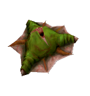



An organic mechanism to place on any surface, which provides 1 spore every x seconds for [weapon_sporelauncher](../weapon_sporelauncher) (Spore launcher). Maximum in supply: 30

<table class="titletable">
<tbody>
<tr>
<td markdown="1">###Keyvalues</td>
<td class="titletablecheck" id="checkboxandlabel"><input type="checkbox" id="displaycommon"><label for="displaycommon"> Display Common Keyvalues</label></input></td>
</tr>
</tbody>
</table>

<b>OnDestroy Function</b> <kbd  class="tooltip" data-tooltip="string">ondestroyfn</kbd> :
Name of the function to use from already parsed .as script files when entity is destroyed (killed) in any way. If the function belongs to namespace, you must use prefix with the namespace name (e.g. mynamespace::MyFunction) for the keyvalue.

<b>Name</b> <kbd  class="tooltip" data-tooltip="target_source">targetname</kbd> :
Set name of {{ entname }} so other entities can trigger it. Only 'On' and 'Toggle' trigger use-types are accepted which makes item be picked up by player '!activator'. Kill-targeting this entity will remove {{ entname }} and stop it from respawning.

<b>Pitch Yaw Roll (X Y Z)</b> <kbd  class="tooltip" data-tooltip="string">angles</kbd> :
Where Z means Y and Y means Z, that is, when you're thinking Hammer-grid. (Hammer uses Z for height and Y for depth, while every other sane 3D-application does this the other way round; nonetheless this keyvalue description has the letters in the conventional order) This, technically, is a 3D-vector containing Euler-angles to describe either the entity's rotation or direction of effect. E.g. a func_door_rotating will use this as its initial rotation, while a trigger_push will keep its original alignment and use this for the direction of its push-effect instead. Euler-angles are a hierarchical system to determine an object's orientation in 3D-space. A yaw-value of 0 would mean the entity would face east. (right in top-down view) 90 would mean it would face north. (up in top-down-view) After yaw, pitch is applied. Think aiming up/down with your character in first person. At last, the roll-value is applied. Think your character falling over sideways in first person. Some entities, mostly point entities, do not use the angles keyvalue for any purpose.

<b>Render FX</b> <kbd  class="tooltip" data-tooltip="choices">renderfx</kbd> :
Set custom render FX effect. Only works when "Render Mode" is set to different than 'Normal'

<input type="checkbox" id="accordion-1" name="accordion-checkbox" hidden>
<label class="accordion-header" for="accordion-1">
<i class="icon icon-arrow-right mr-1"></i>
Choices:
</label>

<ul>
<li><b>0</b> : Normal : Default rendering.</li>
<li><b>1</b> : Slow Pulse : Transparency slow fading in and out in a loop.</li>
<li><b>2</b> : Fast Pulse : Transparency fast fading in and out in a loop.</li>
<li><b>3</b> : Slow Wide Pulse : Transparency slow fading in and out widely in a loop.</li>
<li><b>4</b> : Fast Wide Pulse : Transparency fast fading in and out widely in a loop.</li>
<li><b>9</b> : Slow Strobe : Regular slow appearing/dissapearing.</li>
<li><b>10</b> : Fast Strobe : Regular fast appearing/dissapearing.</li>
<li><b>11</b> : Faster Strobe : Regular very fast appearing/dissapearing.</li>
<li><b>12</b> : Slow Flicker : Random slow appearing/dissapearing.</li>
<li><b>13</b> : Fast Flicker : Random fast appearing/dissapearing.</li>
<li><b>5</b> : Slow Fade Away : Not working. Fading out slowly until reaching invisibility. Works once when entity spawns or have changed it's "Render FX" at a runtime (e.g. through env_render). Requires high "FX Amount"</li>
<li><b>6</b> : Fast Fade Away : Not working. Fading out quickly until reaching invisibility. Works once when entity spawns or have changed it's "Render FX" at a runtime (e.g. through env_render). Requires high "FX Amount"</li>
<li><b>7</b> : Slow Become Solid : Not working. Fading in slowly from invisible to fully visible. Works once when entity spawns or have changed it's "Render FX" at a runtime (e.g. through env_render). Requires low or zero "FX Amount"</li>
<li><b>8</b> : Fast Become Solid : Not working. Fading in quickly from invisible to fully visible. Works once when entity spawns or have changed it's "Render FX" at a runtime (e.g. through env_render). Requires low or zero "FX Amount"</li>
<li><b>14</b> : Constant Glow : Sprites with 'Glow' render mode only. Disables sprite resizing.</li>
<li><b>15</b> : Distort : Random distortion, looped.</li>
<li><b>16</b> : Hologram (Distort + fade) : 'Random distortion' + 'Pulse' applied, looped.</li>
<li><b>19</b> : Glow Shell : Applies nice animated glowing shell on model. Color can be applied. "FX Amount" manipulates glow shell size.</li>
</ul>

<b>Render Mode</b> <kbd  class="tooltip" data-tooltip="choices">rendermode</kbd> :
Render mode determines how this entity is rendered.

<input type="checkbox" id="accordion-2" name="accordion-checkbox" hidden>
<label class="accordion-header" for="accordion-2">
<i class="icon icon-arrow-right mr-1"></i>
Choices:
</label>

<ul>
<li><b>0</b> : Normal : Normal rendering. Entity will receive light, except if it is a sprite. "FX Amount" is obsolete when this is used.</li>
<li><b>1</b> : Color : Brush entities only: Instead of rendering the texture, the whole entity will appear in one color, set by "FX Color". "FX Amount" sets the transparency. 0 means invisible. 255 means fully opaque.</li>
<li><b>2</b> : Texture : Texture-only rendering. Entity will not receive light. Instead, only the texture will be rendered as is. "FX Amount" sets the transparency. 0 means invisible. 255 means fully opaque. This is used for transparent things such as windows. Tip: If you have a window separating a dark and a bright room using only one entity, you can apply a brighter glass texture to the side of the window seen from within the dark room than to the side seen from the bright room. That way, the window's brightness will look realistic from both sides, instead of from just one. Generally, darker rooms require the render amount to be lower, making the glass more transparent, or it would look illogically bright.</li>
<li><b>3</b> : Glow : Sprites only. The sprite will appear in the same size regardless of your distance to it. In addition to that, the further away you are from it, the less visible it will be. (It's only barely visible at about 500 units far away) Good for light coronas. This renders the sprite in additive mode.</li>
<li><b>4</b> : Solid : Brush entities only. All textures of the brush entity starting with '{' will have the last color of their palette (usually blue, black or purple) be rendered fully transparent. This is used for textures with see-through parts, such as grates and railings. Requires "FX Amount" to be set to a value greater than 0, commonly 255.</li>
<li><b>5</b> : Additive : Works just as the "Render Mode" 'Texture', except that the entity's appearance will be added to the background instead of forming a mean. This means, black pixels of textures will be fully transparent, while full-bright pixels are added with a factor of "FX Amount" divided by 255. This is often used for sprites indicating a glowing light, as well as for overlay func_illusionaries to give a computer texture the appearance of having many small, glowing lights, screens and whatever other elements. Render-amount of 255 makes it bright. 0 makes it invisible.</li>
</ul>

<b>FX Amount (1 - 255)</b> <kbd  class="tooltip" data-tooltip="integer">renderamt</kbd> :
Render amount to use when other than "Render Mode" 'Normal' is used.

<b>FX Color (R G B)</b> <kbd  class="tooltip" data-tooltip="color255">rendercolor</kbd> :
Used with "Render Mode" 'Color' and 'Glow' to set color. Also sets color of 'Glow Shell' "Render Mode".

<b>Gravity Setting</b> <kbd  class="tooltip" data-tooltip="choices">movetype</kbd> :
Duplicate?

<input type="checkbox" id="accordion-3" name="accordion-checkbox" hidden>
<label class="accordion-header" for="accordion-3">
<i class="icon icon-arrow-right mr-1"></i>
Choices:
</label>

<ul>
<li><b>-1</b> : Unmoveable</li>
<li><b>0</b> : Fall to the ground (OP4 maps only)</li>
<li><b>5</b> : Hover in the air</li>
<li><b>8</b> : Hover in the air, ignore brush collision</li>
</ul>

<b>Custom respawn time</b> <kbd  class="tooltip" data-tooltip="string">m_flCustomRespawnTime</kbd> :
Customize pickup respawn delay in seconds.

<b>Custom Model</b> <kbd  class="tooltip" data-tooltip="studio">model</kbd> :
You can set the custom model (w_model) for this item here. Can be any model or sprite (it will not animate). That will NOT replace default v_model and p_model of weapon.

<b>Target</b> <kbd  class="tooltip" data-tooltip="target_destination">target</kbd> :
Non-functional in {{ entname }}.

<b>Delay Before Trigger</b> <kbd  class="tooltip" data-tooltip="string">delay</kbd> :
Non-functional in {{ entname }}.

<b>Kill Target</b> <kbd  class="tooltip" data-tooltip="target_destination">killtarget</kbd> :
Non-functional in {{ entname }}.

###Flags

<ul>
<li class="imagepadding" markdown="1"><b>128 </b> : TOUCH Only : Pick this item up only by touching it.</li>
<li class="imagepadding" markdown="1"><b>256 </b> : USE Only : Pick this item up only by using it ('USE' key).</li>
<li class="imagepadding" markdown="1"><b>512 </b> : Can Use w/o LoS : Player can pick up this item even when it's not within his line of sight.</li>
<li class="imagepadding" markdown="1"><b>1024</b> : Disable Respawn : Disables default item respawning.</li>
<li class="imagepadding" markdown="1"><b>2048 </b> : Not in Deathmatch : Obsolete in Sven Co-op. Makes the entity don't appear in Multiplayer Games.</li>
</ul>

As all weapon-, ammo- and item- entities, this respawns after 15 seconds.

Ammo already loaded into weapon doesn't count to maximum ammo in supply (e.g. 6 in Revolver and 36 in supply gives total amount of 42 ammo).

If '"Touch only" and "Use only" flags are selected, the ammo can only be collected by trigger. When those flags are not selected, the ammo also can be collected by trigger, but only if player is the !activator.

