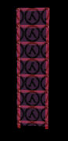



Entity_Description_here

###Keyvalues

<b>OnDestroy Function</b> <kbd  class="tooltip" data-tooltip="string">ondestroyfn</kbd> :
Keyvalue_Description_here

<b>Name</b> <kbd  class="tooltip" data-tooltip="target_source">targetname</kbd> :
Keyvalue_Description_here

<b>ZHLT Template Model Target</b> <kbd  class="tooltip" data-tooltip="string">zhlt_usemodel</kbd> :
Keyvalue_Description_here

<b>ZHLT Copy Lighting From Target</b> <kbd  class="tooltip" data-tooltip="string">zhlt_copylight</kbd> :
Keyvalue_Description_here

<b>ZHLT Disable Clipping</b> <kbd  class="tooltip" data-tooltip="choices">zhlt_noclip</kbd> :
Keyvalue_Description_here

<input type="checkbox" id="accordion-1" name="accordion-checkbox" hidden>
<label class="accordion-header" for="accordion-1">
<i class="icon icon-arrow-right mr-1"></i>
Choices:
</label>

<ul>
<li><b>0 </b> : Default : Choice_Description_here</li>
<li><b>1 </b> : Always non-solid : Choice_Description_here</li>
</ul>

<b>ZHLT Invisible</b> <kbd  class="tooltip" data-tooltip="choices">zhlt_invisible</kbd> :
Keyvalue_Description_here

<input type="checkbox" id="accordion-2" name="accordion-checkbox" hidden>
<label class="accordion-header" for="accordion-2">
<i class="icon icon-arrow-right mr-1"></i>
Choices:
</label>

<ul>
<li><b>0 </b> : Visible (default) : Choice_Description_here</li>
<li><b>1 </b> : Invisible : Choice_Description_here</li>
</ul>

<b>ZHLT Custom Shadow (when opaque)</b> <kbd  class="tooltip" data-tooltip="string">zhlt_customshadow</kbd> :
Keyvalue_Description_here

<b>ZHLT Embed Light Map (when translucent)</b> <kbd  class="tooltip" data-tooltip="choices">zhlt_embedlightmap</kbd> :
Keyvalue_Description_here

<input type="checkbox" id="accordion-3" name="accordion-checkbox" hidden>
<label class="accordion-header" for="accordion-3">
<i class="icon icon-arrow-right mr-1"></i>
Choices:
</label>

<ul>
<li><b>0 </b> : No (default) : Choice_Description_here</li>
<li><b>1 </b> : Yes : Choice_Description_here</li>
</ul>

<b>ZHLT Embed Light Map Resolution</b> <kbd  class="tooltip" data-tooltip="integer">zhlt_embedlightmapresolution</kbd> :
Keyvalue_Description_here

<b></b> <kbd  class="tooltip" data-tooltip="flags">  spawnflags</kbd> :
Keyvalue_Description_here

<input type="checkbox" id="accordion-4" name="accordion-checkbox" hidden>
<label class="accordion-header" for="accordion-4">
<i class="icon icon-arrow-right mr-1"></i>
Choices:
</label>

<ul>
<li><b>1</b> : Start Off : Choice_Description_here</li>
</ul>

Insert additional notes here

Insert known issues here

