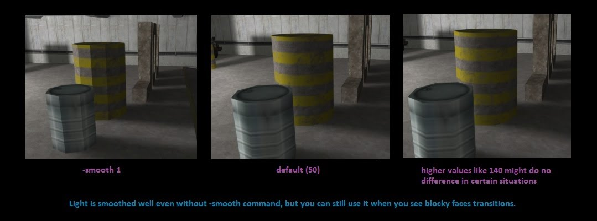



Allows to customize smoothing lightning on specific textures. It overrides 'smooth' command parameter of hlrad compiler. To use this entity, simply place it anywhere in your map, open its properties, disable smart edit mode when using Valve Hammer Editor and add custom keyvalues, whereas the key's name be the name of the texture to change smoothing and the value is smooth amount. This works in the same way as compile command '-smooth':

