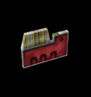



Highly customizable item that can be stored in player inventory based on visual interface, and applies bunch of optional effects on players. Item_inventory contains a lot of trigger conditions. It's possible to make other entities require specific item, abort to have an item, force to drop item e.t.c. You can also make this item usable at player's will from inventory menu (self-activation). This is how you can implement gas masks, invincibility, speed boots, healing potions, keys to locked doors, remote controllers, capture the flag, air tanks and many more! Those entities are fully integrated with item_inventory, each including inventory related keyvalues: 
1. [func_button](../func_button)
2. [func_door](../func_door)
3. [func_door_rotating](../func_door_rotating)
4. [func_rot_button](../func_rot_button)
5. [func_tankcontrols](../func_tankcontrols)
6. [func_traincontrols](../func_traincontrols)
7. [momentary_door](../momentary_door)
8. [trigger_changelevel](../trigger_changelevel)
9. [trigger_hurt](../trigger_hurt)
10. [trigger_multiple](../trigger_multiple)
11. [trigger_once](../trigger_once)
12. [trigger_teleport](../trigger_teleport)
13. [func_water](../func_water)

###Keyvalues

<b>OnDestroy Function</b> <kbd  class="tooltip" data-tooltip="string">ondestroyfn</kbd> :
Name of the function to use from already parsed .as script files when entity is destroyed (killed) in any way. If the function belongs to namespace, you must use prefix with the namespace name (e.g. mynamespace::MyFunction) for the keyvalue.

<b>Name</b> <kbd  class="tooltip" data-tooltip="target_source">targetname</kbd> :
Set name of {{ entname }} so other entities can trigger it. Only 'On' and 'Toggle' signals are accepted which makes item be picked up by player '!activator'. Kill-targeting this entity will remove {{ entname }} and stop it from respawning, also removing from inventory.

<b>Pitch Yaw Roll (X Y Z)</b> <kbd  class="tooltip" data-tooltip="string">angles</kbd> :
Where Z means Y and Y means Z, that is, when you're thinking Hammer-grid. (Hammer uses Z for height and Y for depth, while every other sane 3D-application does this the other way round; nonetheless this keyvalue description has the letters in the conventional order) This, technically, is a 3D-vector containing Euler-angles to describe either the entity's rotation or direction of effect. E.g. a func_door_rotating will use this as its initial rotation, while a trigger_push will keep its original alignment and use this for the direction of its push-effect instead. Euler-angles are a hierarchical system to determine an object's orientation in 3D-space. A yaw-value of 0 would mean the entity would face east. (right in top-down view) 90 would mean it would face north. (up in top-down-view) After yaw, pitch is applied. Think aiming up/down with your character in first person. At last, the roll-value is applied. Think your character falling over sideways in first person. Some entities, mostly point entities, do not use the angles keyvalue for any purpose.

<b>Render FX</b> <kbd  class="tooltip" data-tooltip="choices">renderfx</kbd> :
Set custom render FX effect. Only works when "Render Mode" is set to different 'Normal'

<input type="checkbox" id="accordion-1" name="accordion-checkbox" hidden>
<label class="accordion-header" for="accordion-1">
<i class="icon icon-arrow-right mr-1"></i>
Choices:
</label>

<ul>
<li><b>0</b> : Normal : Default rendering.</li>
<li><b>1</b> : Slow Pulse : Transparency slow fading in and out in a loop.</li>
<li><b>2</b> : Fast Pulse : Transparency fast fading in and out in a loop.</li>
<li><b>3</b> : Slow Wide Pulse : Transparency slow fading in and out widely in a loop.</li>
<li><b>4</b> : Fast Wide Pulse : Transparency fast fading in and out widely in a loop.</li>
<li><b>9</b> : Slow Strobe : Regular slow appearing/dissapearing.</li>
<li><b>10</b> : Fast Strobe : Regular fast appearing/dissapearing.</li>
<li><b>11</b> : Faster Strobe : Regular very fast appearing/dissapearing.</li>
<li><b>12</b> : Slow Flicker : Random slow appearing/dissapearing.</li>
<li><b>13</b> : Fast Flicker : Random fast appearing/dissapearing.</li>
<li><b>5</b> : Slow Fade Away : Not working. Fading out slowly until reaching invisibility. Works once when entity spawns or have changed it's "Render FX" at a runtime (e.g. through env_render). Requires high "FX Amount"</li>
<li><b>6</b> : Fast Fade Away : Not working. Fading out quickly until reaching invisibility. Works once when entity spawns or have changed it's "Render FX" at a runtime (e.g. through env_render). Requires high "FX Amount"</li>
<li><b>7</b> : Slow Become Solid : Not working. Fading in slowly from invisible to fully visible. Works once when entity spawns or have changed it's "Render FX" at a runtime (e.g. through env_render). Requires low or zero "FX Amount"</li>
<li><b>8</b> : Fast Become Solid : Not working. Fading in quickly from invisible to fully visible. Works once when entity spawns or have changed it's "Render FX" at a runtime (e.g. through env_render). Requires low or zero "FX Amount"</li>
<li><b>14</b> : Constant Glow : Sprites with 'Glow' render mode only. Disables sprite resizing.</li>
<li><b>15</b> : Distort : Random distortion, looped.</li>
<li><b>16</b> : Hologram (Distort + fade) : 'Random distortion' + 'Pulse' applied, looped.</li>
<li><b>19</b> : Glow Shell : Applies nice animated glowing shell on model. Color can be applied. "FX Amount" manipulates glow shell size.</li>
</ul>

<b>Render Mode</b> <kbd  class="tooltip" data-tooltip="choices">rendermode</kbd> :
Render mode determines how this entity is rendered.

<input type="checkbox" id="accordion-2" name="accordion-checkbox" hidden>
<label class="accordion-header" for="accordion-2">
<i class="icon icon-arrow-right mr-1"></i>
Choices:
</label>

<ul>
<li><b>0</b> : Normal : Normal rendering. Entity will receive light, except if it is a sprite. "FX Amount" is obsolete when this is used.</li>
<li><b>1</b> : Color : Brush entities only: Instead of rendering the texture, the whole entity will appear in one color, set by "FX Color". "FX Amount" sets the transparency. 0 means invisible. 255 means fully opaque.</li>
<li><b>2</b> : Texture : Texture-only rendering. Entity will not receive light. Instead, only the texture will be rendered as is. "FX Amount" sets the transparency. 0 means invisible. 255 means fully opaque. This is used for transparent things such as windows. Tip: If you have a window separating a dark and a bright room using only one entity, you can apply a brighter glass texture to the side of the window seen from within the dark room than to the side seen from the bright room. That way, the window's brightness will look realistic from both sides, instead of from just one. Generally, darker rooms require the render amount to be lower, making the glass more transparent, or it would look illogically bright.</li>
<li><b>3</b> : Glow : Sprites only. The sprite will appear in the same size regardless of your distance to it. In addition to that, the further away you are from it, the less visible it will be. (It's only barely visible at about 500 units far away) Good for light coronas. This renders the sprite in additive mode.</li>
<li><b>4</b> : Solid : Brush entities only. All textures of the brush entity starting with '{' will have the last color of their palette (usually blue, black or purple) be rendered fully transparent. This is used for textures with see-through parts, such as grates and railings. Requires "FX Amount" to be set to a value greater than 0, commonly 255.</li>
<li><b>5</b> : Additive : Works just as the "Render Mode" 'Texture', except that the entity's appearance will be added to the background instead of forming a mean. This means, black pixels of textures will be fully transparent, while full-bright pixels are added with a factor of "FX Amount" divided by 255. This is often used for sprites indicating a glowing light, as well as for overlay func_illusionaries to give a computer texture the appearance of having many small, glowing lights, screens and whatever other elements. Render-amount of 255 makes it bright. 0 makes it invisible.</li>
</ul>

<b>FX Amount (1 - 255)</b> <kbd  class="tooltip" data-tooltip="integer">renderamt</kbd> :
Render amount to use when other than "Render Mode" 'Normal' is used.

<b>FX Color (R G B)</b> <kbd  class="tooltip" data-tooltip="color255">rendercolor</kbd> :
Used with "Render Mode" 'Color' and 'Glow' to set color. Also sets color of 'Glow Shell' "Render Mode".

<b>Gravity Setting</b> <kbd  class="tooltip" data-tooltip="choices">movetype</kbd> :
Determines how items behave after spawn.

<input type="checkbox" id="accordion-3" name="accordion-checkbox" hidden>
<label class="accordion-header" for="accordion-3">
<i class="icon icon-arrow-right mr-1"></i>
Choices:
</label>

<ul>
<li><b>-1</b> : Unmoveable : Make item completely unmovable by any external influence, unless changed at runtime by e.g. trigger_changevalue.</li>
<li><b>0</b> : Fall to the ground (default) : Entity fall to first brush beneath it. Note that not all entities with collision may block items to fall through them.</li>
<li><b>5</b> : Hover in the air : Items won't fall from it's starting position.</li>
<li><b>8</b> : Hover in the air, ignore brush collision : Items won't fall from it's starting position and won't be affected by brush collision.</li>
</ul>

<b>Solid Setting</b> <kbd  class="tooltip" data-tooltip="choices">solid</kbd> :
Determines item solidity.

<input type="checkbox" id="accordion-4" name="accordion-checkbox" hidden>
<label class="accordion-header" for="accordion-4">
<i class="icon icon-arrow-right mr-1"></i>
Choices:
</label>

<ul>
<li><b>-1</b> : Hollow : Disables solidity completely.</li>
<li><b>0</b> : Touch on edge, non-blocking (default) : Default setting that makes item behave as trigger.</li>
<li><b>2</b> : Touch on edge, blocking (requires hull sizes!) : Makes item solid, it enables collision but requires hull sizes to be specified.</li>
</ul>

<b>Custom Model</b> <kbd  class="tooltip" data-tooltip="studio">model</kbd> :
You need to specify model of {{ entname }}.

<b>Skin</b> <kbd  class="tooltip" data-tooltip="integer">skin</kbd> :
Model skin to use, if model have multiple skins.

<b>Body</b> <kbd  class="tooltip" data-tooltip="integer">body</kbd> :
Model body to use, if model have multiple bodies.

<b>Sequence Name</b> <kbd  class="tooltip" data-tooltip="string">sequencename</kbd> :
Default model sequence name to set.

<b>Sequence Number (overrides name)</b> <kbd  class="tooltip" data-tooltip="integer">sequence</kbd> :
Change model sequence by specifying it's number.

<b>Scale Model</b> <kbd  class="tooltip" data-tooltip="string">scale</kbd> :
Model size scale, higher values for bigger model. Hull is resized as well.

<b>Custom Min Hull Size (X Y Z)</b> <kbd  class="tooltip" data-tooltip="string">minhullsize</kbd> :
If set, this will overwrite the monster's default minimum hullsize. Minimum and maximum hullsize form a solid cuboid which define the monster's collision hull. Think of them as two span-vectors originating from the monster's origin.

<b>Custom Max Hull Size (X Y Z)</b> <kbd  class="tooltip" data-tooltip="string">maxhullsize</kbd> :
If set, this will overwrite the monster's default maximum hullsize. Minimum and maximum hullsize form a solid cuboid which define the monster's collision hull. Think of them as two span-vectors originating from the monster's origin.

<b>Sound Replacement File</b> <kbd  class="tooltip" data-tooltip="string">soundlist</kbd> :
Set the path to a sound replacement file for the item. The path begins in 'svencoop/sound/mapname', whereas 'mapname' would be your map's name. You can go to the parent directory using '../'. A valid sound replacement file contains one or more lines with two sound-paths, which are seperated by a space and wrapped into quotes. The first sound is the sound to be replaced. The second sound is the new sound. Sound-paths start in the sound directory. You cannot go to the parent directory using '../' in that case. These sounds do not need to be precached using a custom_precache point entity.

<b>Target</b> <kbd  class="tooltip" data-tooltip="target_destination">target</kbd> :
Entity to trigger when item is picked up. Sends 'Toggle' trigger state signal.

<b>Delay Before Trigger</b> <kbd  class="tooltip" data-tooltip="string">delay</kbd> :
Delay before trigger entity specified in "Target".

<b>Kill Target</b> <kbd  class="tooltip" data-tooltip="target_destination">killtarget</kbd> :
Same as target, except that this supposedly causes the specified entity/entities to be removed from the game. Not all entities which have a target to trigger will also handle killtarget. You may want to use a [trigger_relay](../trigger_relay) to make sure it is working.

<b>Item name</b> <kbd  class="tooltip" data-tooltip="string">item_name</kbd> :
Name of the item to refer to. This is not a "targetname". You can trigger this item by a "targetname" and you can refer to this item by it's "Item name".

<b>Item group name</b> <kbd  class="tooltip" data-tooltip="string">item_group</kbd> :
You can assign this item to group. You can refer to item group from other item-related keyvalues as well.

<b>Display name (HUD)</b> <kbd  class="tooltip" data-tooltip="string">display_name</kbd> :
It's a display name of item that show up at the inventory menu window.

<b>Description (HUD)</b> <kbd  class="tooltip" data-tooltip="string">description</kbd> :
It's a description of the item player can read at the the inventory menu window.

<b>Item icon (HUD)</b> <kbd  class="tooltip" data-tooltip="string">item_icon</kbd> :
Name of the sprite file to use as item hud icon. Provide the full file name and path relative to the 'sprites' directory.

<b>Self-activation limit (0 = infinite)</b> <kbd  class="tooltip" data-tooltip="integer">activate_limit</kbd> :
If "Holder:Allowed to self-activate" is set to 'Yes', this is a number of times player can activate this item.

<b>Collection limit (0 = infinite)</b> <kbd  class="tooltip" data-tooltip="integer">collect_limit</kbd> :
How many item duplicates player can hold in his inventory. '0' for no limit.

<b>Item weight (0-100)</b> <kbd  class="tooltip" data-tooltip="string">weight</kbd> :
Item weight. The limit for all items in inventory is '100', Over that value player cannot pick up more items.

<b>Collect: Entity target names</b> <kbd  class="tooltip" data-tooltip="string">filter_targetnames</kbd> :
Only enitites with given name(s) can pick up this item.

<b>Collect: Entity class names</b> <kbd  class="tooltip" data-tooltip="string">filter_classnames</kbd> :
Optional filter. Only entities with given class(es) can pick up this item.

<b>Collect: Teams</b> <kbd  class="tooltip" data-tooltip="string">filter_teams</kbd> :
Optional filter. Only players that are part of given team(s) name can pick up this item.

<b>Collect: NPC classifications</b> <kbd  class="tooltip" data-tooltip="choices">filter_npc_classifications</kbd> :
Optional filter. Only Monsters with given class(es) are able to pick up this item.

<input type="checkbox" id="accordion-5" name="accordion-checkbox" hidden>
<label class="accordion-header" for="accordion-5">
<i class="icon icon-arrow-right mr-1"></i>
Choices:
</label>

<ul>
<li><b>0 </b> : No filter : Keep default.</li>
<li><b>-1 </b> : None</li>
<li><b>1 </b> : Machine</li>
<li><b>2 </b> : Player</li>
<li><b>3 </b> : Human Passive</li>
<li><b>4 </b> : Human Military</li>
<li><b>5 </b> : Alien Military</li>
<li><b>6 </b> : Alien Passive</li>
<li><b>7 </b> : Alien Monster</li>
<li><b>8 </b> : Alien Prey</li>
<li><b>9 </b> : Alien Predator</li>
<li><b>10 </b> : Insect</li>
<li><b>11 </b> : Player Ally</li>
<li><b>12 </b> : Player Hornet/Snark</li>
<li><b>13 </b> : Alien Hornet/Snark</li>
<li><b>14 </b> : X-Race</li>
<li><b>15 </b> : X-Race: Shocktrooper/Voltigore</li>
<li><b>16 </b> : Team 1 : Use it to classify to custom team.</li>
<li><b>17 </b> : Team 2 : Use it to classify to custom team.</li>
<li><b>18 </b> : Team 3 : Use it to classify to custom team.</li>
<li><b>19 </b> : Team 4 : Use it to classify to custom team.</li>
</ul>

<b>Collect: Need item(s)</b> <kbd  class="tooltip" data-tooltip="string">item_name_required</kbd> :
Name of required item(s) (held in inventory) to pick up this item.

<b>Collect: Need item(s) from group(s)</b> <kbd  class="tooltip" data-tooltip="string">item_group_required</kbd> :
Name of group(s) (in which item(s) from player inventory belongs) required to pick up this item.

<b>Collect: Item count in group need have (0 = all)</b> <kbd  class="tooltip" data-tooltip="integer">item_group_required_num</kbd> :
Total number of items that are part of specified group(s) required to pick up this item. Specify a group names in keyvalue above.

<b>Collect: Item(s) moved</b> <kbd  class="tooltip" data-tooltip="string">item_name_moved</kbd> :
Allow to pick up this item only when specified item_inventory wasn't relocated yet (and is not in someone's inventory).

<b>Collect: CAN'T have item</b> <kbd  class="tooltip" data-tooltip="string">item_name_canthave</kbd> :
Name of item(s) in player inventory that prevents from picking up this item off the ground.

<b>Collect: CAN'T have item from group</b> <kbd  class="tooltip" data-tooltip="string">item_group_canthave</kbd> :
Name of group(s) (in which item(s) from player inventory belongs) that prevents from picking up this item off the ground.

<b>Collect: Item count in group CAN'T have (0 = all)</b> <kbd  class="tooltip" data-tooltip="integer">item_group_canthave_num</kbd> :
Total number of items that are part of specified group(s) that prevents from picking up this item from a ground. Specify a group names in keyvalue above.

<b>Collect: Item(s) NOT moved</b> <kbd  class="tooltip" data-tooltip="string">item_name_not_moved</kbd> :
Allow to pick up this item only when specified entities (of item_inventory class) has been moved from it's starting position.

<b>Carried: Hide item (3rd person)</b> <kbd  class="tooltip" data-tooltip="choices">carried_hidden</kbd> :
Hide item from 3rd person view. When 'No' is selected, the item model is floating above player head when equipped.

<input type="checkbox" id="accordion-6" name="accordion-checkbox" hidden>
<label class="accordion-header" for="accordion-6">
<i class="icon icon-arrow-right mr-1"></i>
Choices:
</label>

<ul>
<li><b>0 </b> : No</li>
<li><b>1 </b> : Yes</li>
</ul>

<b>Carried: Skin</b> <kbd  class="tooltip" data-tooltip="integer">carried_skin</kbd> :
Change models' skin of carried item (only when it's not hidden).

<b>Carried: Body</b> <kbd  class="tooltip" data-tooltip="integer">carried_body</kbd> :
Change models' body of carried item (only when it's not hidden).

<b>Carried: Sequence Name</b> <kbd  class="tooltip" data-tooltip="string">carried_sequencename</kbd> :
Change models' sequence of carried item (only when it's not hidden).

<b>Carried: Sequence Number (overrides name)</b> <kbd  class="tooltip" data-tooltip="integer">carried_sequence</kbd> :
Change models' sequence by specifying it's number.

<b>Return: Wait (-1 = never)</b> <kbd  class="tooltip" data-tooltip="string">return_timelimit</kbd> :
After this amount of time the item returns to it's starting position (when dropped somewhere else).

<b>Return: Delay respawn (materialisation)</b> <kbd  class="tooltip" data-tooltip="choices">return_delay_respawn</kbd> :
Allows to specify if item_inventory will wait for respawn after returning to it's default position.

<input type="checkbox" id="accordion-7" name="accordion-checkbox" hidden>
<label class="accordion-header" for="accordion-7">
<i class="icon icon-arrow-right mr-1"></i>
Choices:
</label>

<ul>
<li><b>0 </b> : No</li>
<li><b>1 </b> : Yes</li>
</ul>

<b>Holder: Hold time limit (0 = never)</b> <kbd  class="tooltip" data-tooltip="string">holder_timelimit</kbd> :
Maximum time the item can be held on for, then it's returning if possible.

<b>Holder: Delay between self-activations (0 = none)</b> <kbd  class="tooltip" data-tooltip="string">holder_time_activate_wait</kbd> :
If 'Holder:Allowed to self-activate' is set to 'Yes', this is a delay between which player can activate this item.

<b>Holder: Wearing out trigger time (0 = none)</b> <kbd  class="tooltip" data-tooltip="string">holder_time_wearout</kbd> :
Time before "Holder: Hold time limit" reach it's limit to trigger target specified in "Target: On wearing out" keyvalue. If you set it to e.g. 4, it will fire a target 4 seconds before this item's "Holder: Hold time limit" ends. It's useful if you want to trigger a sound or a [game_text](../game_text) informing player that item will be worn out soon. Example: player picked up power-up which have "Holder: Hold time limit" set to 10, and "Holder: Wearing out trigger time" to 3, so 3 seconds before item is removed from player (in other words, before "Holder: Hold time limit" ends) game_text specified in "Target: On wearing out" is fired with message "Warning! 3 seconds for buff to end!".

<b>Holder: Allowed to self-activate</b> <kbd  class="tooltip" data-tooltip="choices">holder_can_activate</kbd> :
Set it to 'Yes' allows players to activate this item by themselves from inventory menu.

<input type="checkbox" id="accordion-8" name="accordion-checkbox" hidden>
<label class="accordion-header" for="accordion-8">
<i class="icon icon-arrow-right mr-1"></i>
Choices:
</label>

<ul>
<li><b>0 </b> : No</li>
<li><b>1 </b> : Yes</li>
</ul>

<b>Holder: Hold time limit doesn't start until item activated</b> <kbd  class="tooltip" data-tooltip="choices">holder_timelimit_wait_until_activated</kbd> :
If set to 'Yes', hold time limit doesn't start until item is activated by player through inventory menu.

<input type="checkbox" id="accordion-9" name="accordion-checkbox" hidden>
<label class="accordion-header" for="accordion-9">
<i class="icon icon-arrow-right mr-1"></i>
Choices:
</label>

<ul>
<li><b>0 </b> : No</li>
<li><b>1 </b> : Yes</li>
</ul>

<b>Holder: Allowed to drop</b> <kbd  class="tooltip" data-tooltip="choices">holder_can_drop</kbd> :
Determines whenever item can be dropped manually by player from within inventory menu.

<input type="checkbox" id="accordion-10" name="accordion-checkbox" hidden>
<label class="accordion-header" for="accordion-10">
<i class="icon icon-arrow-right mr-1"></i>
Choices:
</label>

<ul>
<li><b>0 </b> : No</li>
<li><b>1 </b> : Yes</li>
</ul>

<b>Holder: Keep item on death</b> <kbd  class="tooltip" data-tooltip="choices">holder_keep_on_death</kbd> :
Self-explanatory. Note that player will lost this item after respawn if keyvalue below isn't set to 'Yes'.

<input type="checkbox" id="accordion-11" name="accordion-checkbox" hidden>
<label class="accordion-header" for="accordion-11">
<i class="icon icon-arrow-right mr-1"></i>
Choices:
</label>

<ul>
<li><b>0 </b> : No</li>
<li><b>1 </b> : Yes</li>
</ul>

<b>Holder: Keep item on respawn</b> <kbd  class="tooltip" data-tooltip="choices">holder_keep_on_respawn</kbd> :
Self-explanatory. Remember that player can also lose his item on death, if "Keep item on death" is set to 'No', the player won't keep this item.

<input type="checkbox" id="accordion-12" name="accordion-checkbox" hidden>
<label class="accordion-header" for="accordion-12">
<i class="icon icon-arrow-right mr-1"></i>
Choices:
</label>

<ul>
<li><b>0 </b> : No</li>
<li><b>1 </b> : Yes</li>
</ul>

<b>Target: On collect (self)</b> <kbd  class="tooltip" data-tooltip="string">target_on_collect</kbd> :
Fire specified target(s) when item is successfully collected (uses 'Toggle' trigger state). Player who collected it is passed as the '!activator'.

<b>Target: On collect (team)</b> <kbd  class="tooltip" data-tooltip="string">target_on_collect_team</kbd> :
Same as above, but passes whole team (in which player belongs, including this player) as '!activator'.

<b>Target: On collect (others)</b> <kbd  class="tooltip" data-tooltip="string">target_on_collect_other</kbd> :
Same as above, but passes everyone else but player as '!activator'.

<b>Target: On can't collect (self)</b> <kbd  class="tooltip" data-tooltip="string">target_cant_collect</kbd> :
Fire specified target(s) when item collecting attempt failed (uses 'Toggle' trigger state). Player who failed to collect item is passed as the '!activator'.

<b>Target: On can't collect (team)</b> <kbd  class="tooltip" data-tooltip="string">target_cant_collect_team</kbd> :
Same as above, but passes whole team (in which player belongs, including this player) as '!activator'.

<b>Target: On can't collect (others)</b> <kbd  class="tooltip" data-tooltip="string">target_cant_collect_other</kbd> :
Same as above, but passes everyone else but player as '!activator'.

<b>Target: On drop (self)</b> <kbd  class="tooltip" data-tooltip="string">target_on_drop</kbd> :
Fire specified target(s) when item is dropped (uses 'Toggle' trigger state). Player who dropped it is passed as the '!activator'.

<b>Target: On drop (team)</b> <kbd  class="tooltip" data-tooltip="string">target_on_drop_team</kbd> :
Same as above, but passes whole team (in which player belongs, including this player) as '!activator'.

<b>Target: On drop (others)</b> <kbd  class="tooltip" data-tooltip="string">target_on_drop_other</kbd> :
Same as above, but passes everyone else but player as '!activator'.

<b>Target: On can't drop (self)</b> <kbd  class="tooltip" data-tooltip="string">target_cant_drop</kbd> :
Fire specified target(s) when item is drop failed (uses 'Toggle' trigger state). Player who failed dropping item it is passed as the '!activator'.

<b>Target: On can't drop (team)</b> <kbd  class="tooltip" data-tooltip="string">target_cant_drop_team</kbd> :
Same as above, but passes whole team (in which player belongs, including this player) as '!activator'.

<b>Target: On can't drop (others)</b> <kbd  class="tooltip" data-tooltip="string">target_cant_drop_other</kbd> :
Same as above, but passes everyone else but player as '!activator'.

<b>Target: On self-activate (self)</b> <kbd  class="tooltip" data-tooltip="string">target_on_activate</kbd> :
Fire specified target(s) when player activate item from inventory menu, only if "Allowed to self-activate" is set to 'Yes' (uses 'Toggle' trigger state). Player who activated it is passed as the '!activator'.

<b>Target: On self-activate (team)</b> <kbd  class="tooltip" data-tooltip="string">target_on_activate_team</kbd> :
Same as above, but passes whole team (in which player belongs, including this player) as '!activator'.

<b>Target: On self-activate (others)</b> <kbd  class="tooltip" data-tooltip="string">target_on_activate_other</kbd> :
Same as above, but passes everyone else but player as '!activator'.

<b>Target: On can't self-activate (self)</b> <kbd  class="tooltip" data-tooltip="string">target_cant_activate</kbd> :
If "Allowed to self-activate" is set to 'Yes' and item activation limit hit 0, this is a target to fire when player attempts to activate it again (uses 'Toggle' trigger state). Player who failed it is passed as the '!activator'.

<b>Target: On can't self-activate (team)</b> <kbd  class="tooltip" data-tooltip="string">target_cant_activate_team</kbd> :
Same as above, but passes whole team (in which player belongs, including this player) as '!activator'.

<b>Target: On can't self-activate (others)</b> <kbd  class="tooltip" data-tooltip="string">target_cant_activate_other</kbd> :
Same as above, but passes everyone else but player as '!activator'.

<b>Target: On use by trigger (self)</b> <kbd  class="tooltip" data-tooltip="string">target_on_use</kbd> :
Fire specified target(s) when item is used by trigger (uses 'Toggle' trigger state). Player is passed as the 'activator!'.

<b>Target: On use by trigger (team)</b> <kbd  class="tooltip" data-tooltip="string">target_on_use_team</kbd> :
Same as above, but passes whole team (in which player belongs, including this player) as '!activator'.

<b>Target: On use by trigger (others)</b> <kbd  class="tooltip" data-tooltip="string">target_on_use_other</kbd> :
Same as above, but passes everyone else but player as '!activator'.

<b>Target: On wearing out (self)</b> <kbd  class="tooltip" data-tooltip="string">target_on_wearing_out</kbd> :
Fire specified target(s) when item's "Wearing out trigger time" ends (which must be greater than 0 but less than "Holder: Hold time limit" value), see "Holder: Wearing out trigger time" above for more info (uses 'Toggle' trigger state). Player who owns this item is passed as the '!activator'.

<b>Target: On wearing out (team)</b> <kbd  class="tooltip" data-tooltip="string">target_on_wearing_out_team</kbd> :
Same as above, but passes whole team (in which player belongs, including this player) as '!activator'.

<b>Target: On wearing out (others)</b> <kbd  class="tooltip" data-tooltip="string">target_on_wearing_out_other</kbd> :
Same as above, but passes everyone else but player as '!activator'.

<b>Target: On return (self)</b> <kbd  class="tooltip" data-tooltip="string">target_on_return</kbd> :
Fire specified target(s) when item returns to it's starting position (uses 'Toggle' trigger state).

<b>Target: On return (team)</b> <kbd  class="tooltip" data-tooltip="string">target_on_return_team</kbd> :
Same as above, but passes whole team (in which player belongs, including this player) as '!activator'.

<b>Target: On return (other)</b> <kbd  class="tooltip" data-tooltip="string">target_on_return_other</kbd> :
Same as above, but passes everyone else but player as '!activator'.

<b>Target: On materialise after return</b> <kbd  class="tooltip" data-tooltip="string">target_on_materialise</kbd> :
Fire specified target when item gets materialised after a drop or return (uses 'Toggle' trigger state).

<b>Target: On destroy</b> <kbd  class="tooltip" data-tooltip="string">target_on_destroy</kbd> :
Fire specified target when item gets destroyed by environment (uses 'Toggle' trigger state).

<b>Effects: Wait until item is self-activated?</b> <kbd  class="tooltip" data-tooltip="choices">effects_wait_until_activated</kbd> :
If "Allowed to self-activate" is set to 'Yes', this will determine if effects should be applied only when player activate an item from inventory menu.

<input type="checkbox" id="accordion-13" name="accordion-checkbox" hidden>
<label class="accordion-header" for="accordion-13">
<i class="icon icon-arrow-right mr-1"></i>
Choices:
</label>

<ul>
<li><b>0 </b> : No</li>
<li><b>1 </b> : Yes</li>
</ul>

<b>Effects: Permanent? (Until respawn)</b> <kbd  class="tooltip" data-tooltip="choices">effects_permanent</kbd> :
Specify if effects below effect applied on player are permanent ('Yes') or temporary ('No'). If option 'No' is chosen, the effects ends after "Holder: Hold Time Limit" is hit, and if 'Yes' is selected, effect ends after respawn.

<input type="checkbox" id="accordion-14" name="accordion-checkbox" hidden>
<label class="accordion-header" for="accordion-14">
<i class="icon icon-arrow-right mr-1"></i>
Choices:
</label>

<ul>
<li><b>0 </b> : No</li>
<li><b>1 </b> : Yes</li>
</ul>

<b>Effects: Glow shell color (R G B)</b> <kbd  class="tooltip" data-tooltip="color255">effect_glow</kbd> :
Color of glow shell effect to apply. '0 0 0' for none.

<b>Effects: Block weapons</b> <kbd  class="tooltip" data-tooltip="choices">effect_block_weapons</kbd> :
Prevent player from using weapons ('Yes'/'No').

<input type="checkbox" id="accordion-15" name="accordion-checkbox" hidden>
<label class="accordion-header" for="accordion-15">
<i class="icon icon-arrow-right mr-1"></i>
Choices:
</label>

<ul>
<li><b>0 </b> : No</li>
<li><b>1 </b> : Yes</li>
</ul>

<b>Effects: Invulnerable</b> <kbd  class="tooltip" data-tooltip="choices">effect_invulnerable</kbd> :
Makes player invulnerable ('Yes'/'No').

<input type="checkbox" id="accordion-16" name="accordion-checkbox" hidden>
<label class="accordion-header" for="accordion-16">
<i class="icon icon-arrow-right mr-1"></i>
Choices:
</label>

<ul>
<li><b>0 </b> : No</li>
<li><b>1 </b> : Yes</li>
</ul>

<b>Effects: Invisible</b> <kbd  class="tooltip" data-tooltip="choices">effect_invisible</kbd> :
Makes player invisible (for enemies) ('Yes'/'No').

<input type="checkbox" id="accordion-17" name="accordion-checkbox" hidden>
<label class="accordion-header" for="accordion-17">
<i class="icon icon-arrow-right mr-1"></i>
Choices:
</label>

<ul>
<li><b>0 </b> : No</li>
<li><b>1 </b> : Yes</li>
</ul>

<b>Effects: Non-solid</b> <kbd  class="tooltip" data-tooltip="choices">effect_nonsolid</kbd> :
Makes player not-solid for different dynamic objects ('Yes'/'No').

<input type="checkbox" id="accordion-18" name="accordion-checkbox" hidden>
<label class="accordion-header" for="accordion-18">
<i class="icon icon-arrow-right mr-1"></i>
Choices:
</label>

<ul>
<li><b>0 </b> : No</li>
<li><b>1 </b> : Yes</li>
</ul>

<b>Effects: Time before drown (seconds)</b> <kbd  class="tooltip" data-tooltip="string">effect_respiration</kbd> :
Additional amount of time before drown (can be negative!).

<b>Effects: Friction modifier (%)</b> <kbd  class="tooltip" data-tooltip="string">effect_friction</kbd> :
Percent of friction to change on player.

<b>Effects: Gravity modifier (%)</b> <kbd  class="tooltip" data-tooltip="string">effect_gravity</kbd> :
Percent of gravity to change on player.

<b>Effects: Speed modifier (%)</b> <kbd  class="tooltip" data-tooltip="string">effect_speed</kbd> :
Percent of speed to change on player. Weapon_minigun does not affect this value.

<b>Effects: Damage modifier (%)</b> <kbd  class="tooltip" data-tooltip="string">effect_damage</kbd> :
Player damage modifier in percent.

###Flags

<ul>
<li class="imagepadding" markdown="1"><b>128 </b> : TOUCH Only : Pick this item up only by touching it.</li>
<li class="imagepadding" markdown="1"><b>256 </b> : USE Only : Pick this item up only by using it ('USE' key).</li>
<li class="imagepadding" markdown="1"><b>512 </b> : Can Use w/o LoS : Player can pick up this item even when it's not within his line of sight.</li>
<li class="imagepadding" markdown="1"><b>1024</b> : Disable Respawn : Disables default item respawning.</li>
<li class="imagepadding" markdown="1"><b>2048 </b> : Not in Deathmatch : Obsolete in Sven Co-op. Makes the entity don't appear in Multiplayer Games.</li>
</ul>

Use semicolon ';' to separate multiple item/target/group names in filters and conditions.

If both 'TOUCH only' and 'USE only' flags are selected, the item can only be collected by trigger, but only if player is the !activator.

Item can be collected on trigger, touch and use when none of flags above are selected.

You can specify a group of affected players in all trigger fields making it possible to have different action for different players.

