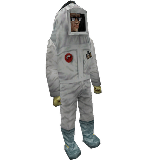



Entity_Description_here

###Keyvalues

<b>OnDestroy Function</b> <kbd  class="tooltip" data-tooltip="string">ondestroyfn</kbd> :
Keyvalue_Description_here

<b>Name</b> <kbd  class="tooltip" data-tooltip="target_source">targetname</kbd> :
Keyvalue_Description_here

<b>Target</b> <kbd  class="tooltip" data-tooltip="target_destination">target</kbd> :
Keyvalue_Description_here

<b>Render FX</b> <kbd  class="tooltip" data-tooltip="choices">renderfx</kbd> :
Keyvalue_Description_here

<input type="checkbox" id="accordion-1" name="accordion-checkbox" hidden>
<label class="accordion-header" for="accordion-1">
<i class="icon icon-arrow-right mr-1"></i>
Choices:
</label>

<ul>
<li><b>0</b> : Normal : Choice_Description_here</li>
<li><b>1</b> : Slow Pulse : Choice_Description_here</li>
<li><b>2</b> : Fast Pulse : Choice_Description_here</li>
<li><b>3</b> : Slow Wide Pulse : Choice_Description_here</li>
<li><b>4</b> : Fast Wide Pulse : Choice_Description_here</li>
<li><b>9</b> : Slow Strobe : Choice_Description_here</li>
<li><b>10</b> : Fast Strobe : Choice_Description_here</li>
<li><b>11</b> : Faster Strobe : Choice_Description_here</li>
<li><b>12</b> : Slow Flicker : Choice_Description_here</li>
<li><b>13</b> : Fast Flicker : Choice_Description_here</li>
<li><b>5</b> : Slow Fade Away : Choice_Description_here</li>
<li><b>6</b> : Fast Fade Away : Choice_Description_here</li>
<li><b>7</b> : Slow Become Solid : Choice_Description_here</li>
<li><b>8</b> : Fast Become Solid : Choice_Description_here</li>
<li><b>14</b> : Constant Glow : Choice_Description_here</li>
<li><b>15</b> : Distort : Choice_Description_here</li>
<li><b>16</b> : Hologram (Distort + fade) : Choice_Description_here</li>
<li><b>17</b> : Dead Player (DONT USE!) : Choice_Description_here</li>
<li><b>18</b> : Explode (Garg Like) : Choice_Description_here</li>
<li><b>19</b> : Glow Shell : Choice_Description_here</li>
<li><b>20</b> : ClampMinScale (Sprites) : Choice_Description_here</li>
</ul>

<b>Render Mode</b> <kbd  class="tooltip" data-tooltip="choices">rendermode</kbd> :
Keyvalue_Description_here

<input type="checkbox" id="accordion-2" name="accordion-checkbox" hidden>
<label class="accordion-header" for="accordion-2">
<i class="icon icon-arrow-right mr-1"></i>
Choices:
</label>

<ul>
<li><b>0</b> : Normal : Choice_Description_here</li>
<li><b>1</b> : Color : Choice_Description_here</li>
<li><b>2</b> : Texture : Choice_Description_here</li>
<li><b>3</b> : Glow : Choice_Description_here</li>
<li><b>4</b> : Solid : Choice_Description_here</li>
<li><b>5</b> : Additive : Choice_Description_here</li>
</ul>

<b>FX Amount (1 - 255)</b> <kbd  class="tooltip" data-tooltip="integer">renderamt</kbd> :
Keyvalue_Description_here

<b>FX Color (R G B)</b> <kbd  class="tooltip" data-tooltip="color255">rendercolor</kbd> :
Keyvalue_Description_here

<b>Pitch Yaw Roll (X Y Z)</b> <kbd  class="tooltip" data-tooltip="string">angles</kbd> :
Where Z means Y and Y means Z, that is, when you're thinking Hammer-grid. (Hammer uses Z for height and Y for depth, while every other sane 3D-application does this the other way round; nonetheless this keyvalue description has the letters in the conventional order) This, technically, is a 3D-vector containing Euler-angles to describe either the entity's rotation or direction of effect. E.g. a func_door_rotating will use this as its initial rotation, while a trigger_push will keep its original alignment and use this for the direction of its push-effect instead. Euler-angles are a hierarchical system to determine an object's orientation in 3D-space. A yaw-value of 0 would mean the entity would face east. (right in top-down view) 90 would mean it would face north. (up in top-down-view) After yaw, pitch is applied. Think aiming up/down with your character in first person. At last, the roll-value is applied. Think your character falling over sideways in first person. Some entities, mostly point entities, do not use the angles keyvalue for any purpose.

<b>Classification</b> <kbd  class="tooltip" data-tooltip="choices">classify</kbd> :
Set the class of the spawned {{ entname }}. Think of how even though zombies and human grunts, by default, both are the players' enemies, yet have a dislike for and attack each other as well. This relation is created through the respective classes of the two entity types. For a complete table of how different classes react to each other, see [monster class relation table](https://wiki.svencoop.com/Class_Relationship_Table).

<input type="checkbox" id="accordion-3" name="accordion-checkbox" hidden>
<label class="accordion-header" for="accordion-3">
<i class="icon icon-arrow-right mr-1"></i>
Choices:
</label>

<ul>
<li><b>-1 </b> : None</li>
<li><b>0 </b> : Object Default : Keep default classification.</li>
<li><b>1 </b> : Machine</li>
<li><b>2 </b> : Player</li>
<li><b>3 </b> : Human Passive</li>
<li><b>4 </b> : Human Military</li>
<li><b>5 </b> : Alien Military</li>
<li><b>6 </b> : Alien Passive</li>
<li><b>7 </b> : Alien Monster</li>
<li><b>8 </b> : Alien Prey</li>
<li><b>9 </b> : Alien Predator</li>
<li><b>10 </b> : Insect</li>
<li><b>11 </b> : Player Ally</li>
<li><b>12 </b> : Player Hornet/Snark</li>
<li><b>13 </b> : Alien Hornet/Snark</li>
<li><b>14 </b> : X-Race</li>
<li><b>15 </b> : X-Race: Shocktrooper/Voltigore</li>
<li><b>16 </b> : Team 1 : Use it to classify to custom team.</li>
<li><b>17 </b> : Team 2 : Use it to classify to custom team.</li>
<li><b>18 </b> : Team 3 : Use it to classify to custom team.</li>
<li><b>19 </b> : Team 4 : Use it to classify to custom team.</li>
</ul>

<b>Is not revivable</b> <kbd  class="tooltip" data-tooltip="choices">is_not_revivable</kbd> :
Keyvalue_Description_here

<input type="checkbox" id="accordion-4" name="accordion-checkbox" hidden>
<label class="accordion-header" for="accordion-4">
<i class="icon icon-arrow-right mr-1"></i>
Choices:
</label>

<ul>
<li><b>0 </b> : No : Choice_Description_here</li>
<li><b>1 </b> : Yes : Choice_Description_here</li>
</ul>

<b>Trigger Condition</b> <kbd  class="tooltip" data-tooltip="Choices">TriggerCondition</kbd> :
Keyvalue_Description_here

<input type="checkbox" id="accordion-5" name="accordion-checkbox" hidden>
<label class="accordion-header" for="accordion-5">
<i class="icon icon-arrow-right mr-1"></i>
Choices:
</label>

<ul>
<li><b>0 </b> : No Trigger : Choice_Description_here</li>
<li><b>1 </b> : See Player, Mad at Player : Choice_Description_here</li>
<li><b>2 </b> : Take Damage : Choice_Description_here</li>
<li><b>3 </b> : 50% Health Remaining : Choice_Description_here</li>
<li><b>4 </b> : Death : Choice_Description_here</li>
<li><b>7 </b> : Hear World : Choice_Description_here</li>
<li><b>8 </b> : Hear Player : Choice_Description_here</li>
<li><b>9 </b> : Hear Combat : Choice_Description_here</li>
<li><b>10</b> : See Player Unconditional : Choice_Description_here</li>
<li><b>11</b> : See Player, Not In Combat : Choice_Description_here</li>
</ul>

<b>Trigger Condition Target</b> <kbd  class="tooltip" data-tooltip="String">TriggerTarget</kbd> :
Keyvalue_Description_here

<b>Body</b> <kbd  class="tooltip" data-tooltip="choices">body</kbd> :
Keyvalue_Description_here

<input type="checkbox" id="accordion-6" name="accordion-checkbox" hidden>
<label class="accordion-header" for="accordion-6">
<i class="icon icon-arrow-right mr-1"></i>
Choices:
</label>

<ul>
<li><b>0 </b> : 0 : Choice_Description_here</li>
</ul>

<b>Skin</b> <kbd  class="tooltip" data-tooltip="choices">skin</kbd> :
Keyvalue_Description_here

<input type="checkbox" id="accordion-7" name="accordion-checkbox" hidden>
<label class="accordion-header" for="accordion-7">
<i class="icon icon-arrow-right mr-1"></i>
Choices:
</label>

<ul>
<li><b>0 </b> : 0 : Choice_Description_here</li>
</ul>

<b>Is Player Ally?</b> <kbd  class="tooltip" data-tooltip="Choices">is_player_ally</kbd> :
Keyvalue_Description_here

<input type="checkbox" id="accordion-8" name="accordion-checkbox" hidden>
<label class="accordion-header" for="accordion-8">
<i class="icon icon-arrow-right mr-1"></i>
Choices:
</label>

<ul>
<li><b>0 </b> : No (Default) : Choice_Description_here</li>
<li><b>1 </b> : Yes : Choice_Description_here</li>
</ul>

<b>In-game Name</b> <kbd  class="tooltip" data-tooltip="string">displayname</kbd> :
Keyvalue_Description_here

<b>Blood Color</b> <kbd  class="tooltip" data-tooltip="choices">bloodcolor</kbd> :
Keyvalue_Description_here

<input type="checkbox" id="accordion-9" name="accordion-checkbox" hidden>
<label class="accordion-header" for="accordion-9">
<i class="icon icon-arrow-right mr-1"></i>
Choices:
</label>

<ul>
<li><b>0 </b> : Monster Default : Choice_Description_here</li>
<li><b>-1 </b> : No Blood : Choice_Description_here</li>
<li><b>1 </b> : Red : Choice_Description_here</li>
<li><b>2 </b> : Yellow : Choice_Description_here</li>
</ul>

<b>Custom Health</b> <kbd  class="tooltip" data-tooltip="integer">health</kbd> :
Keyvalue_Description_here

<b>Custom Model</b> <kbd  class="tooltip" data-tooltip="studio">model</kbd> :
Keyvalue_Description_here

<b>Custom Min Hull Size (X Y Z)</b> <kbd  class="tooltip" data-tooltip="string">minhullsize</kbd> :
Keyvalue_Description_here

<b>Custom Max Hull Size (X Y Z)</b> <kbd  class="tooltip" data-tooltip="string">maxhullsize</kbd> :
Keyvalue_Description_here

<b>Sound Replacement File</b> <kbd  class="tooltip" data-tooltip="string">soundlist</kbd> :
Keyvalue_Description_here

<b>Monster Roaming (nodes)</b> <kbd  class="tooltip" data-tooltip="Choices">freeroam</kbd> :
Keyvalue_Description_here

<input type="checkbox" id="accordion-10" name="accordion-checkbox" hidden>
<label class="accordion-header" for="accordion-10">
<i class="icon icon-arrow-right mr-1"></i>
Choices:
</label>

<ul>
<li><b>0 </b> : Map Default : Choice_Description_here</li>
<li><b>1 </b> : Never : Choice_Description_here</li>
<li><b>2 </b> : Always : Choice_Description_here</li>
</ul>

<b>Path Name</b> <kbd  class="tooltip" data-tooltip="string">path_name</kbd> :
Keyvalue_Description_here

<b>Entity to Guard</b> <kbd  class="tooltip" data-tooltip="string">guard_ent</kbd> :
Keyvalue_Description_here

<b>Use Sentence</b> <kbd  class="tooltip" data-tooltip="String">UseSentence</kbd> :
Keyvalue_Description_here

<b>Un-Use Sentence</b> <kbd  class="tooltip" data-tooltip="String">UnUseSentence</kbd> :
Keyvalue_Description_here

<b>Is Player Ally?</b> <kbd  class="tooltip" data-tooltip="Choices">is_player_ally</kbd> :
Keyvalue_Description_here

<input type="checkbox" id="accordion-11" name="accordion-checkbox" hidden>
<label class="accordion-header" for="accordion-11">
<i class="icon icon-arrow-right mr-1"></i>
Choices:
</label>

<ul>
<li><b>0 </b> : Yes (Default) : Choice_Description_here</li>
<li><b>1 </b> : No : Choice_Description_here</li>
</ul>

<b>Body</b> <kbd  class="tooltip" data-tooltip="Choices">body</kbd> :
Keyvalue_Description_here

<input type="checkbox" id="accordion-12" name="accordion-checkbox" hidden>
<label class="accordion-header" for="accordion-12">
<i class="icon icon-arrow-right mr-1"></i>
Choices:
</label>

<ul>
<li><b>-1 </b> : Random : Choice_Description_here</li>
<li><b>0 </b> : Glasses : Choice_Description_here</li>
<li><b>1 </b> : Einstein : Choice_Description_here</li>
<li><b>2 </b> : Luther : Choice_Description_here</li>
<li><b>3 </b> : Slick : Choice_Description_here</li>
</ul>

<b>Animation Sequence (editor)</b> <kbd  class="tooltip" data-tooltip="Choices">sequence</kbd> :
Keyvalue_Description_here

<input type="checkbox" id="accordion-13" name="accordion-checkbox" hidden>
<label class="accordion-header" for="accordion-13">
<i class="icon icon-arrow-right mr-1"></i>
Choices:
</label>

<ul>
<li><b>13 </b> : idle1 : Choice_Description_here</li>
<li><b>27 </b> : eye_wipe : Choice_Description_here</li>
<li><b>28 </b> : pull_needle : Choice_Description_here</li>
<li><b>29 </b> : return_needle : Choice_Description_here</li>
<li><b>30 </b> : give_shot : Choice_Description_here</li>
<li><b>41 </b> : germandeath : Choice_Description_here</li>
<li><b>48 </b> : console : Choice_Description_here</li>
<li><b>49 </b> : dryhands : Choice_Description_here</li>
<li><b>50 </b> : tieshoe : Choice_Description_here</li>
<li><b>51 </b> : whiteboard : Choice_Description_here</li>
<li><b>52 </b> : studycart : Choice_Description_here</li>
<li><b>53 </b> : lean : Choice_Description_here</li>
<li><b>54 </b> : pondering : Choice_Description_here</li>
<li><b>55 </b> : pondering2 : Choice_Description_here</li>
<li><b>56 </b> : pondering3 : Choice_Description_here</li>
<li><b>57 </b> : buysoda : Choice_Description_here</li>
<li><b>61 </b> : push_button : Choice_Description_here</li>
<li><b>62 </b> : converse1 : Choice_Description_here</li>
<li><b>63 </b> : converse2 : Choice_Description_here</li>
<li><b>64 </b> : retina : Choice_Description_here</li>
<li><b>65 </b> : talkleft : Choice_Description_here</li>
<li><b>66 </b> : talkright : Choice_Description_here</li>
<li><b>67 </b> : deskidle : Choice_Description_here</li>
<li><b>68 </b> : coffee : Choice_Description_here</li>
<li><b>69 </b> : franticbutton : Choice_Description_here</li>
<li><b>71 </b> : scientist_throwna : Choice_Description_here</li>
<li><b>72 </b> : scientist_thrownb : Choice_Description_here</li>
<li><b>73 </b> : scientist_beatwindow : Choice_Description_here</li>
<li><b>75 </b> : scientist_zombiefear : Choice_Description_here</li>
<li><b>77 </b> : teleport_fidget : Choice_Description_here</li>
<li><b>79 </b> : sitlookleft : Choice_Description_here</li>
<li><b>80 </b> : sitlookright : Choice_Description_here</li>
<li><b>81 </b> : sitscared : Choice_Description_here</li>
<li><b>82 </b> : sitting2 : Choice_Description_here</li>
<li><b>83 </b> : sitting3 : Choice_Description_here</li>
<li><b>84 </b> : cprscientist : Choice_Description_here</li>
<li><b>85 </b> : cprscientistrevive : Choice_Description_here</li>
<li><b>86 </b> : cowering_in_corner : Choice_Description_here</li>
<li><b>87 </b> : sstruggleidle : Choice_Description_here</li>
<li><b>88 </b> : sstruggle : Choice_Description_here</li>
<li><b>89 </b> : headcrabbed : Choice_Description_here</li>
<li><b>90 </b> : c1a0_catwalkidle : Choice_Description_here</li>
<li><b>91 </b> : c1a0_catwalk : Choice_Description_here</li>
<li><b>92 </b> : ceiling_dangle : Choice_Description_here</li>
<li><b>93 </b> : ventpull1 : Choice_Description_here</li>
<li><b>94 </b> : ventpull2 : Choice_Description_here</li>
<li><b>95 </b> : ventpullidle1 : Choice_Description_here</li>
<li><b>96 </b> : ventpullidle2 : Choice_Description_here</li>
<li><b>97 </b> : sitidle : Choice_Description_here</li>
<li><b>98 </b> : sitstand : Choice_Description_here</li>
<li><b>99 </b> : keypad : Choice_Description_here</li>
<li><b>101 </b> : lookwindow : Choice_Description_here</li>
<li><b>102 </b> : wave : Choice_Description_here</li>
<li><b>103 </b> : pulldoor : Choice_Description_here</li>
<li><b>104 </b> : beatdoor : Choice_Description_here</li>
<li><b>105 </b> : fallingloop : Choice_Description_here</li>
<li><b>106 </b> : crawlwindow : Choice_Description_here</li>
<li><b>107 </b> : divewindow : Choice_Description_here</li>
<li><b>108 </b> : locked_door : Choice_Description_here</li>
<li><b>109 </b> : push_button2 : Choice_Description_here</li>
<li><b>110 </b> : unlock_door : Choice_Description_here</li>
<li><b>112 </b> : handrailidle : Choice_Description_here</li>
<li><b>113 </b> : handrail : Choice_Description_here</li>
<li><b>114 </b> : hanging_idle : Choice_Description_here</li>
<li><b>115 </b> : fall : Choice_Description_here</li>
<li><b>116 </b> : scientist_get_pulled : Choice_Description_here</li>
<li><b>117 </b> : hanging_idle2 : Choice_Description_here</li>
<li><b>118 </b> : fall_elevator : Choice_Description_here</li>
<li><b>119 </b> : scientist_idlewall : Choice_Description_here</li>
<li><b>120 </b> : ickyjump_sci : Choice_Description_here</li>
<li><b>121 </b> : haulscientist : Choice_Description_here</li>
<li><b>122 </b> : c1a4_wounded_idle : Choice_Description_here</li>
<li><b>123 </b> : c1a4_dying_speech : Choice_Description_here</li>
<li><b>124 </b> : tentacle_grab : Choice_Description_here</li>
<li><b>125 </b> : helicack : Choice_Description_here</li>
<li><b>126 </b> : windive : Choice_Description_here</li>
<li><b>127 </b> : scicrashidle : Choice_Description_here</li>
<li><b>128 </b> : scicrash : Choice_Description_here</li>
<li><b>129 </b> : onguard : Choice_Description_here</li>
<li><b>130 </b> : seeya : Choice_Description_here</li>
<li><b>131 </b> : rocketcrawl : Choice_Description_here</li>
<li><b>132 </b> : portal : Choice_Description_here</li>
<li><b>133 </b> : gluonshow : Choice_Description_here</li>
<li><b>135 </b> : kneel : Choice_Description_here</li>
</ul>

###Flags

<ul>
<li class="imagepadding" markdown="1"><b>1 </b> : WaitTillSeen : Choice_Description_here</li>
<li class="imagepadding" markdown="1"><b>2 </b> : Gag : Choice_Description_here</li>
<li class="imagepadding" markdown="1"><b>4 </b> : MonsterClip : Choice_Description_here</li>
<li class="imagepadding" markdown="1"><b>16</b> : Prisoner : Choice_Description_here</li>
<li class="imagepadding" markdown="1"><b>128</b> : WaitForScript : Choice_Description_here</li>
<li class="imagepadding" markdown="1"><b>256</b> : Pre-Disaster : Choice_Description_here</li>
<li class="imagepadding" markdown="1"><b>512</b> : Don't Fade Corpse : Choice_Description_here</li>
<li class="imagepadding" markdown="1"><b>2048 </b> : Not in Deathmatch : Obsolete in Sven Co-op. Makes the entity don't appear in Multiplayer Games.</li>
<li class="imagepadding" markdown="1"><b>16384</b> : No Dyn Collision : Choice_Description_here</li>
</ul>

Insert additional notes here

Insert known issues here

