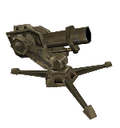



A big static mortar which has the mechanical means to turn left/right and change its pitch in order to acquire its target. Can be set to aim and fire automatically or be controllable by players through [func_op4mortarcontroller](../func_op4mortarcontroller). The op4mortar is not solid; you might want to wrap it in a clip brush. It also is indestructible and thus not targeted by its enemies. It shows no HUD information. Its maximum rotation speed is 40 degrees per second for each, pitch and yaw.

###Keyvalues

<b>OnDestroy Function</b> <kbd  class="tooltip" data-tooltip="string">ondestroyfn</kbd> :
Name of the function to use from already parsed .as script files when entity is destroyed (killed) in any way. If the function belongs to namespace, you must use prefix with the namespace name (e.g. mynamespace::MyFunction) for the keyvalue.

<b>Name</b> <kbd  class="tooltip" data-tooltip="target_source">targetname</kbd> :
Set name of {{ entname }} so other entities can trigger it to shoot. Only 'On' trigger use-type is accepted. Can be kill-targeted.

<b>Classification</b> <kbd  class="tooltip" data-tooltip="choices">classify</kbd> :
Set the class of the spawned {{ entname }}. Think of how even though zombies and human grunts, by default, both are the players' enemies, yet have a dislike for and attack each other as well. This relation is created through the respective classes of the two entity types. For a complete table of how different classes react to each other, see [monster class relation table](https://wiki.svencoop.com/Class_Relationship_Table).

<input type="checkbox" id="accordion-1" name="accordion-checkbox" hidden>
<label class="accordion-header" for="accordion-1">
<i class="icon icon-arrow-right mr-1"></i>
Choices:
</label>

<ul>
<li><b>-1 </b> : None</li>
<li><b>0 </b> : Object Default : Keep default classification.</li>
<li><b>1 </b> : Machine</li>
<li><b>2 </b> : Player</li>
<li><b>3 </b> : Human Passive</li>
<li><b>4 </b> : Human Military</li>
<li><b>5 </b> : Alien Military</li>
<li><b>6 </b> : Alien Passive</li>
<li><b>7 </b> : Alien Monster</li>
<li><b>8 </b> : Alien Prey</li>
<li><b>9 </b> : Alien Predator</li>
<li><b>10 </b> : Insect</li>
<li><b>11 </b> : Player Ally</li>
<li><b>12 </b> : Player Hornet/Snark</li>
<li><b>13 </b> : Alien Hornet/Snark</li>
<li><b>14 </b> : X-Race</li>
<li><b>15 </b> : X-Race: Shocktrooper/Voltigore</li>
<li><b>16 </b> : Team 1 : Use it to classify to custom team.</li>
<li><b>17 </b> : Team 2 : Use it to classify to custom team.</li>
<li><b>18 </b> : Team 3 : Use it to classify to custom team.</li>
<li><b>19 </b> : Team 4 : Use it to classify to custom team.</li>
</ul>

<b>Velocity</b> <kbd  class="tooltip" data-tooltip="integer">mortar_velocity</kbd> :
Speed of the explosive projectile shot by the mortar in units per second. A mortar with high velocity needs to aim higher at the sky than mortars with lower velocity to hit close targets. The mortar won't try using a pitch of less than 45 degrees. A firing angle of 45 degrees provides the greatest distance, under the condition, that there is no air drag and the height at which the object is fired is the same as the height at which the object hits the ground.

<b>Horiz MIN</b> <kbd  class="tooltip" data-tooltip="integer">h_min</kbd> :
Maximum rotation to the left from the given yaw-angle.

<b>Horiz MAX</b> <kbd  class="tooltip" data-tooltip="integer">h_max</kbd> :
Maximum rotation to the right from the given yaw-angle.

<b>Min Target Dist</b> <kbd  class="tooltip" data-tooltip="integer">mindist</kbd> :
Minimum distance projectile can travel.

<b>Max Target Dist</b> <kbd  class="tooltip" data-tooltip="integer">maxdist</kbd> :
Maximum distance projectile can travel.

<b>Delay between shots (seconds)</b> <kbd  class="tooltip" data-tooltip="integer">firedelay</kbd> :
The delay between shots, in seconds. Minimum accepted by the game is one second, to avoid spamming.

<b>Is Player Ally</b> <kbd  class="tooltip" data-tooltip="Choices">is_player_ally</kbd> :
If this op4mortar is set to fire automatically with "Active" flag enabled, this defines whether it will handle players as enemies or not. Furthermore, this defines whether players can be damaged by the projectile's explosion in the first place. The firing player can always get hurt.

<input type="checkbox" id="accordion-2" name="accordion-checkbox" hidden>
<label class="accordion-header" for="accordion-2">
<i class="icon icon-arrow-right mr-1"></i>
Choices:
</label>

<ul>
<li><b>0 </b> : No (Default)</li>
<li><b>1 </b> : Yes</li>
</ul>

###Flags

<ul>
<li class="imagepadding" markdown="1"><b>1  </b> : Active : If set, the mortar will start active and aim and fire automatically. If not set, the op4mortar needs a targetname in order to start off.</li>
<li class="imagepadding" markdown="1"><b>16 </b> : Line of Sight : If set, the op4mortar will only fire if its target is in direct line of sight. Otherwise, it will fire whenever a target is within range, regardless of whether there is a wall blocking the line ('curve') of fire or not.</li>
<li class="imagepadding" markdown="1"><b>32 </b> : Can Control : If set, this op4mortar can be controlled through a [func_op4mortarcontroller](../func_op4mortarcontroller). Obsoletes the "Active" flag. Triggering op4mortar will cause it to fire, with respect to its delay between shots.</li>
</ul>

