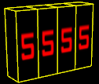



Display a number on set of brush entities covered, for best results, with '+0~HEX_00' texture. The number is picked from keyvalue of chosen entity e.g. "health" from "monster_scientist". You can pick any accessible value from any entity, supports [Private Entity Variables](../entitykeyvalues). The number is displayed on brushes specified in "Base digit name" keyvalue of this entity. Each brush covered with '+0~HEX_00' (or any other animated texture) represent single digit. Example: if you want to display three digit number, and "Base digit name" is set to "num_brush", the brush entities must be named "num_brush1", "num_brush2" and "num_brush3". Those brushes should be placed in reversed order, from right to left ("num_brush1" represents far right digit, "num_brush2" represents center digit, and "num_brush3" represents far left digit).

###Keyvalues

<input type="checkbox" id="accordion-1" name="accordion-checkbox" hidden>
<label class="accordion-header" for="accordion-1">
<b>OnDestroy Function</b>
<i class="icon icon-arrow-right mr-1"></i>
</label>

<b>OnDestroy Function</b> <kbd  class="tooltip" data-tooltip="string">ondestroyfn</kbd> :
Name of the function to use from already parsed .as script files when entity is destroyed (killed) in any way. If the function belongs to namespace, you must use prefix with the namespace name (e.g. mynamespace::MyFunction) for the keyvalue.

<b>Name</b> <kbd  class="tooltip" data-tooltip="target_source">targetname</kbd> :
Set name of {{ entname }} so other entities can trigger it to start updating displayed value (or update value once when "Cyclic" flag is checked). With "Cyclic" flag disabled the behaviour is based on trigger use-type: 'On'- turn displayed value update on, 'Off'- turn displayed value update off, 'Toggle'- toggle displayed value update. With "Cyclic" flag enabled all trigger use-types are accepted to update displayed number once. Can be kill-targeted.

<b>Entity to track</b> <kbd  class="tooltip" data-tooltip="target_destination">target</kbd> :
The entity from which the value is picked. This value will be displayed.

<b>Key to read</b> <kbd  class="tooltip" data-tooltip="string">netname</kbd> :
Keyvalue to pick a number from e.g. "health".

<b>Base digit name</b> <kbd  class="tooltip" data-tooltip="string">message</kbd> :
Name of brush entities on which the number will be displayed. Animated texture of those entities will be manipulated to fit accessed value. Brushes need to be named with following pattern: 'basename%d', where basename must be the same in every affected brush, and %d is a number increased for each brush (starting at 1) e.g. "brushdigit1", "brushdigit2", "brushdigit3" e.t.c. The iteration starts from right to left- number 573 will be spliced into parts as follow: "brushdigit1" = 3, "brushdigit2" = 7, "brushdigit3" = 5.

<b>Update delay</b> <kbd  class="tooltip" data-tooltip="string">frags</kbd> :
Time interval between value updates. The smaller the value is, the more frequently number is updated.

###Flags

<ul>
<li class="imagepadding" markdown="1"><b>1 </b> : Start On : Entity is activated on start.</li>
<li class="imagepadding" markdown="1"><b>2 </b> : Cyclic : Changes the trigger_numericdisplay's behaviour to a single-fire-behaviour. With this flag set, the number will be updated once, and then idle until triggered again.</li>
<li class="imagepadding" markdown="1"><b>4 </b> : Ignore leading zeroes : All leading zeroes will be displayed as an 'a' letter ('+A~HEX_00'), so "0345" is converted to "a345". This is useful because 'a' texture may represents empty space so values like 00045 will be shown as 45.</li>
<li class="imagepadding" markdown="1"><b>8 </b> : Zero as leading : Zero number is treated as a leading zero.</li>
</ul>

If other texture in '~texturename' sequence is used, (e.g. '+3~HEX_00' instead of '+0~HEX_00'), then displayed digit value is increased by three, for '+7~HEX_00' value is increased by seven e.t.c.

Entity supports any texture that is animated, even if there are missing animation frames. If no '+a' texture provided, the texture will animate itself normally.

