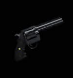



Entity_Description_here

###Keyvalues

<b>OnDestroy Function</b> <kbd  class="tooltip" data-tooltip="string">ondestroyfn</kbd> :
Keyvalue_Description_here

<b>Name</b> <kbd  class="tooltip" data-tooltip="target_source">targetname</kbd> :
Keyvalue_Description_here

<b>Pitch Yaw Roll (X Y Z)</b> <kbd  class="tooltip" data-tooltip="string">angles</kbd> :
Where Z means Y and Y means Z, that is, when you're thinking Hammer-grid. (Hammer uses Z for height and Y for depth, while every other sane 3D-application does this the other way round; nonetheless this keyvalue description has the letters in the conventional order) This, technically, is a 3D-vector containing Euler-angles to describe either the entity's rotation or direction of effect. E.g. a func_door_rotating will use this as its initial rotation, while a trigger_push will keep its original alignment and use this for the direction of its push-effect instead. Euler-angles are a hierarchical system to determine an object's orientation in 3D-space. A yaw-value of 0 would mean the entity would face east. (right in top-down view) 90 would mean it would face north. (up in top-down-view) After yaw, pitch is applied. Think aiming up/down with your character in first person. At last, the roll-value is applied. Think your character falling over sideways in first person. Some entities, mostly point entities, do not use the angles keyvalue for any purpose.

<b>Render FX</b> <kbd  class="tooltip" data-tooltip="choices">renderfx</kbd> :
Keyvalue_Description_here

<input type="checkbox" id="accordion-1" name="accordion-checkbox" hidden>
<label class="accordion-header" for="accordion-1">
<i class="icon icon-arrow-right mr-1"></i>
Choices:
</label>

<ul>
<li><b>0</b> : Normal : Choice_Description_here</li>
<li><b>1</b> : Slow Pulse : Choice_Description_here</li>
<li><b>2</b> : Fast Pulse : Choice_Description_here</li>
<li><b>3</b> : Slow Wide Pulse : Choice_Description_here</li>
<li><b>4</b> : Fast Wide Pulse : Choice_Description_here</li>
<li><b>9</b> : Slow Strobe : Choice_Description_here</li>
<li><b>10</b> : Fast Strobe : Choice_Description_here</li>
<li><b>11</b> : Faster Strobe : Choice_Description_here</li>
<li><b>12</b> : Slow Flicker : Choice_Description_here</li>
<li><b>13</b> : Fast Flicker : Choice_Description_here</li>
<li><b>5</b> : Slow Fade Away : Choice_Description_here</li>
<li><b>6</b> : Fast Fade Away : Choice_Description_here</li>
<li><b>7</b> : Slow Become Solid : Choice_Description_here</li>
<li><b>8</b> : Fast Become Solid : Choice_Description_here</li>
<li><b>14</b> : Constant Glow : Choice_Description_here</li>
<li><b>15</b> : Distort : Choice_Description_here</li>
<li><b>16</b> : Hologram (Distort + fade) : Choice_Description_here</li>
<li><b>19</b> : Glow Shell : Choice_Description_here</li>
</ul>

<b>Render Mode</b> <kbd  class="tooltip" data-tooltip="choices">rendermode</kbd> :
Keyvalue_Description_here

<input type="checkbox" id="accordion-2" name="accordion-checkbox" hidden>
<label class="accordion-header" for="accordion-2">
<i class="icon icon-arrow-right mr-1"></i>
Choices:
</label>

<ul>
<li><b>0</b> : Normal : Choice_Description_here</li>
<li><b>1</b> : Color : Choice_Description_here</li>
<li><b>2</b> : Texture : Choice_Description_here</li>
<li><b>3</b> : Glow : Choice_Description_here</li>
<li><b>4</b> : Solid : Choice_Description_here</li>
<li><b>5</b> : Additive : Choice_Description_here</li>
</ul>

<b>FX Amount (1 - 255)</b> <kbd  class="tooltip" data-tooltip="integer">renderamt</kbd> :
Keyvalue_Description_here

<b>FX Color (R G B)</b> <kbd  class="tooltip" data-tooltip="color255">rendercolor</kbd> :
Keyvalue_Description_here

<b>Gravity Setting</b> <kbd  class="tooltip" data-tooltip="choices">movetype</kbd> :
Keyvalue_Description_here

<input type="checkbox" id="accordion-3" name="accordion-checkbox" hidden>
<label class="accordion-header" for="accordion-3">
<i class="icon icon-arrow-right mr-1"></i>
Choices:
</label>

<ul>
<li><b>-1</b> : Unmoveable : Choice_Description_here</li>
<li><b>0</b> : Fall to the ground (default) : Choice_Description_here</li>
<li><b>5</b> : Hover in the air : Choice_Description_here</li>
<li><b>8</b> : Hover in the air, ignore brush collision : Choice_Description_here</li>
</ul>

<b>Custom respawn time</b> <kbd  class="tooltip" data-tooltip="string">m_flCustomRespawnTime</kbd> :
Keyvalue_Description_here

<b>Custom Damage</b> <kbd  class="tooltip" data-tooltip="integer">dmg</kbd> :
Keyvalue_Description_here

<b>Custom V_Model</b> <kbd  class="tooltip" data-tooltip="studio">wpn_v_model</kbd> :
Keyvalue_Description_here

<b>Custom W_Model</b> <kbd  class="tooltip" data-tooltip="studio">wpn_w_model</kbd> :
Keyvalue_Description_here

<b>Custom P_Model</b> <kbd  class="tooltip" data-tooltip="studio">wpn_p_model</kbd> :
Keyvalue_Description_here

<b>Sound Replacement File</b> <kbd  class="tooltip" data-tooltip="string">soundlist</kbd> :
Keyvalue_Description_here

<b>Custom sprite directory</b> <kbd  class="tooltip" data-tooltip="string">CustomSpriteDir</kbd> :
Keyvalue_Description_here

<b>Is Ammo Item</b> <kbd  class="tooltip" data-tooltip="choices">IsNotAmmoItem</kbd> :
Keyvalue_Description_here

<input type="checkbox" id="accordion-4" name="accordion-checkbox" hidden>
<label class="accordion-header" for="accordion-4">
<i class="icon icon-arrow-right mr-1"></i>
Choices:
</label>

<ul>
<li><b>0 </b> : Yes : Choice_Description_here</li>
<li><b>1 </b> : No : Choice_Description_here</li>
</ul>

<b>Target</b> <kbd  class="tooltip" data-tooltip="target_destination">target</kbd> :
Keyvalue_Description_here

<b>Delay Before Trigger</b> <kbd  class="tooltip" data-tooltip="string">delay</kbd> :
Keyvalue_Description_here

<b>Kill Target</b> <kbd  class="tooltip" data-tooltip="target_destination">killtarget</kbd> :
Keyvalue_Description_here

<b>Exclusive Hold</b> <kbd  class="tooltip" data-tooltip="choices">exclusivehold</kbd> :
Keyvalue_Description_here

<input type="checkbox" id="accordion-5" name="accordion-checkbox" hidden>
<label class="accordion-header" for="accordion-5">
<i class="icon icon-arrow-right mr-1"></i>
Choices:
</label>

<ul>
<li><b>0 </b> : No : Choice_Description_here</li>
<li><b>1 </b> : Yes : Choice_Description_here</li>
</ul>

###Flags

<ul>
<li class="imagepadding" markdown="1"><b>128 </b> : TOUCH Only : Choice_Description_here</li>
<li class="imagepadding" markdown="1"><b>256 </b> : USE Only : Choice_Description_here</li>
<li class="imagepadding" markdown="1"><b>512 </b> : Can Use w/o LoS : Choice_Description_here</li>
<li class="imagepadding" markdown="1"><b>1024</b> : Disable Respawn : Choice_Description_here</li>
<li class="imagepadding" markdown="1"><b>2048 </b> : Not in Deathmatch : Obsolete in Sven Co-op. Makes the entity don't appear in Multiplayer Games.</li>
</ul>

Insert additional notes here

Insert known issues here

